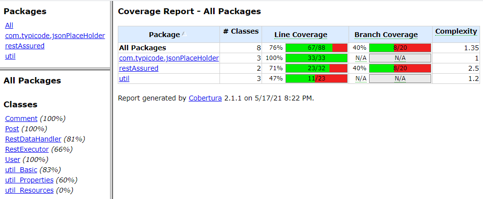

# Code-Challenge

### {JSON} Placeholder
> https://jsonplaceholder.typicode.com

# [Code Challenge Work Flow](src/test/java/com/typicode/jsonPlaceHolder/TestWorkFlow_CodeChallenge.java) 

1. Search for the user with username “Delphine”.
2. Use the details fetched to make a search for the posts written by the
user.
3. For each post, fetch the comments and validate if the emails in the
comment section are in the proper format.
4. Think of various scenarios for the test workflow, all the things that
can go wrong. Add them to test coverage

_____________
## Additional Test Blocks & Work Flows

> Test Blocks
#### [Users](src/test/java/com/typicode/jsonPlaceHolder/TestBlock_User.java)
1. Validate whether the User Name 'X' is Unique".
2. Validate whether the addition of User is successful, though its faked/mocked !!
3. Validate whether the deletion of User is successful, though its faked/mocked !!
#### [Posts](src/test/java/com/typicode/jsonPlaceHolder/TestBlock_Post.java) 
1. Validate whether the User Id 'X' has 'Y' number of Posts.
#### [Comments](src/test/java/com/typicode/jsonPlaceHolder/TestBlock_Comment.java) 
1. Validate Email format for each Comments in the Post Id 'X'

_____________
# Circle CI 
> [config.yml](.circleci/config.yml)
## Below you can find the sample Circle CI pipeline execution insights.
### Pipeline Job Status

### Pipeline Job | Steps

#### > Test Report] Allure

#### > Code Coverage Report] Cobertura

